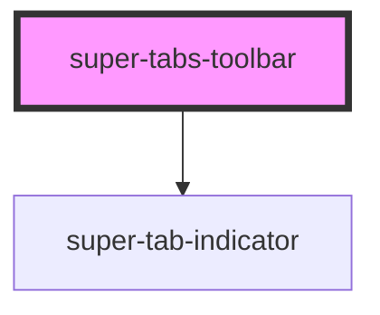

# super-tabs-toolbar

<!-- Auto Generated Below -->

## Properties

| Property            | Attribute            | Description                                                                                                                                                                                              | Type      | Default     |
| ------------------- | -------------------- | -------------------------------------------------------------------------------------------------------------------------------------------------------------------------------------------------------- | --------- | ----------- |
| `color`             | `color`              | Background color. Defaults to `'primary'`                                                                                                                                                                | `string`  | `'primary'` |
| `scrollable`        | `scrollable`         | Whether the toolbar is scrollable. Defaults to `false`.                                                                                                                                                  | `boolean` | `false`     |
| `scrollablePadding` | `scrollable-padding` | If scrollable is set to true, there will be an added padding to the left of the buttons.  Setting this property to false will remove that padding.  The padding is also configurable via a CSS variable. | `boolean` | `true`      |
| `showIndicator`     | `show-indicator`     | Whether to show the indicator. Defaults to `true`                                                                                                                                                        | `boolean` | `true`      |

## Events

| Event         | Description | Type                                     |
| ------------- | ----------- | ---------------------------------------- |
| `buttonClick` |             | `CustomEvent<HTMLSuperTabButtonElement>` |

## CSS Custom Properties

| Name                                   | Description                                                        |
| -------------------------------------- | ------------------------------------------------------------------ |
| `--st-scrollable-toolbar-padding-left` | Left padding when `scrollable` is set to true. Defaults to `52px`. |
| `--super-tabs-toolbar-background`      | Toolbar background color. Defaults to `--ion-color-base`.          |

## Dependencies

### Depends on

- [super-tab-indicator](../super-tab-indicator)

### Graph

----------------------------------------------

*Built with [StencilJS](https://stenciljs.com/)*
