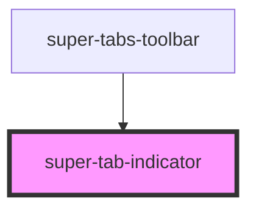

# super-tab-indicator

<!-- Auto Generated Below -->

## Properties

| Property          | Attribute          | Description                                                    | Type                | Default |
| ----------------- | ------------------ | -------------------------------------------------------------- | ------------------- | ------- |
| `toolbarPosition` | `toolbar-position` | Toolbar position This determines the position of the indicator | `"bottom" \| "top"` | `'top'` |

## CSS Custom Properties

| Name                    | Description                                          |
| ----------------------- | ---------------------------------------------------- |
| `--st-indicator-color`  | Indicator color. Defaults to `--ion-color-contrast`. |
| `--st-indicator-height` | Indicator height. Defaults to `2px`.                 |

## Dependencies

### Used by

 - [super-tabs-toolbar](../super-tabs-toolbar)

### Graph

----------------------------------------------

*Built with [StencilJS](https://stenciljs.com/)*
